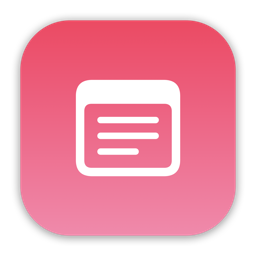

<!-- PROJECT LOGO -->

<h3>   Done  

<a href="">note team</a>     </h3>   

 
   

## Big Idea
Serve people who are distracted and busy who have many responsibilities during their day and their lives, as the idea from its inception was in short one word (activating notifications)..

## Challenge Statement
 The challenge is to find a way to help people by organizing their tasks and reminding them of the chosen time and day

## Solution Concept
The solution lies in the idea that it is necessary for the user's access to the service to be fast, smooth and simplified in terms of all aspects.

## Technologies & Tools
This goal was achieved using the design program (Sketch)
and programming the application using the SwiftUI language (Xcode).

## Demo
https://drive.google.com/file/d/18O_ogO9X5uE_SH_Bt9O308BnlIxvQyO5/view?usp=sharing

The user can, as shown in the video:

1. The ability to create an infinite number of folder that can be renamed, set reminder of their list from drag folder name.

2. The ability to create a check their lists, also delete and edit .

3. Application support localization and accessibility by voiceover

## Challenge Summary

Finding a way for helping people to be  reminded of their necessary  needs
## Team
1. Nourah Almusaad 
2. Arwa Almalki 
